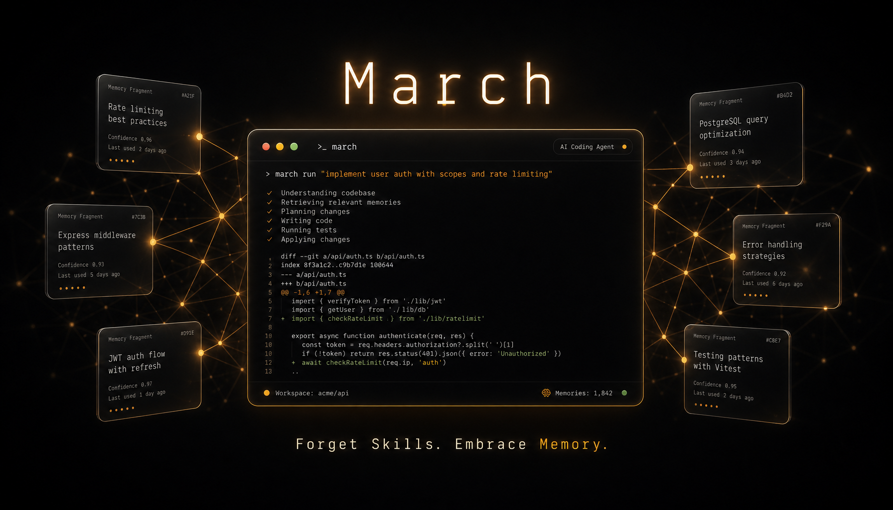

<p align="center">
  
</p>

<p align="center"><strong>Forget Skills. Embrace Memory. Keep your model in the sweet spot.</strong></p>

<p align="center">
  <a href="https://www.npmjs.com/package/march-cli"></a>
</p>

<p align="center">
  <a href="README.md">English</a> |
  <a href="README.zh.md">简体中文</a>
</p>

---

### Installation

```bash
npm install -g march-cli
```

### Why Token Efficient?

March is obsessively token-efficient. After each turn, context resets to ~8K — we **discard** all intermediate execution and keep only two things: the user's question and the AI's final response.

Most agents fight context bloat with compression, truncation, retrieval, summarization. March's answer: just throw away what you don't need.

The result:

- **91% cache hit rate**, individual model calls rarely exceed 50K tokens
- Context never grows unbounded — **no context rot**
- Your model always operates in the sweet spot, not drowning in 100K of noise

### Memory System

March has a built-in memory system. Anything you tell March — preferences, project conventions, technical decisions — it remembers. When you need it again, March **automatically recalls** relevant memories during its thinking process. No manual search required.

#### No Skill Files

The problem with Skill systems: Skill files inject context upfront. What happens when you have too many?

March takes a different approach: every memory is a "latent skill," recalled on-demand rather than always sitting in context. What you've discussed is the best prompt.

#### Managing Memories

March stores memories as Markdown files under `~/.march/March Memories/`. You can directly edit, delete, or add files — March auto-detects changes.

### Built-in Capabilities

**Image Generation**: If you have access to ChatGPT Codex, March can generate images directly — no extra API keys or third-party services.

**Web Search**: Connect SuperGrok and **all your configured models** gain web search. March dispatches Grok to search and injects results into the current conversation.

**More Search**: Tavily Search and Brave Search are built in.

### Configuration

March uses `~/.march/config.json` (global) or `<project>/.march/config.json` (project-level) for model and provider configuration. Compatible with any OpenAI-compatible API.

```json
{
  "provider": "openai",
  "model": "gpt-5.1"
}
```

See the [docs](docs/custom-provider.md) for custom providers, multi-model setup, and more.

### FAQ

#### How is this different from Claude Code?

March is similarly capable but takes a fundamentally different approach to context. Instead of keeping everything in context and relying on compression, March resets context each turn — you get ~8K clean context every time, with 91% cache hit rate. March also replaces Skill files with a built-in memory system that recalls on demand.

#### How is this different from OpenCode?

Both are open source, terminal-native agents. March's key differentiators: extreme token efficiency via per-turn context reset, a built-in Markdown memory system with automatic recall, and the philosophy that memories should be recalled on-demand — not injected upfront like Skills.

### Documentation

- [Full Documentation](docs/) — configuration, context management, memory system
- [Custom Provider](docs/custom-provider.md) — connect local models or third-party APIs
- [Context Management](docs/context-core.md) — March's context architecture explained
- [Memory System](docs/markdown-memory-system.md) — storage and recall mechanism


