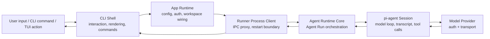
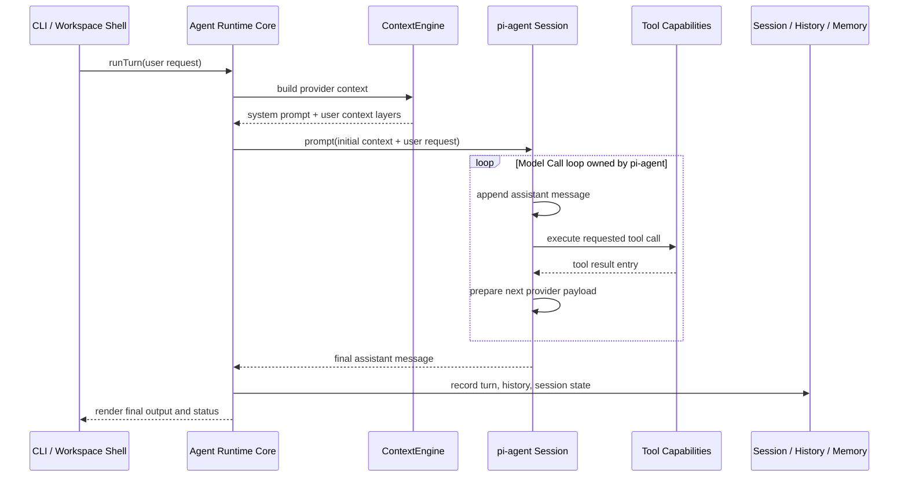
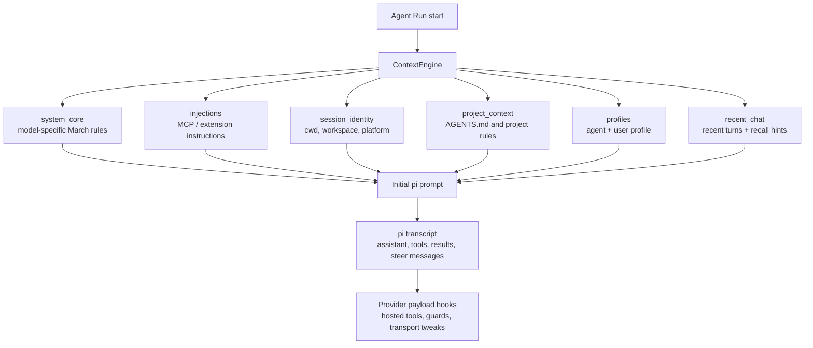
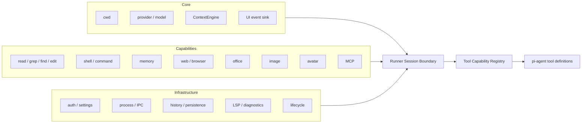
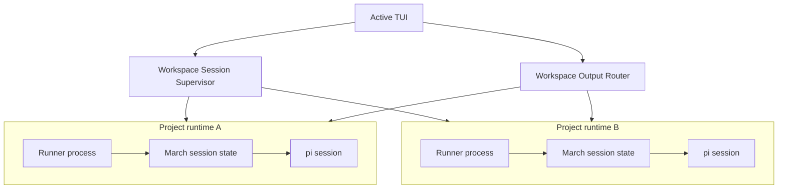
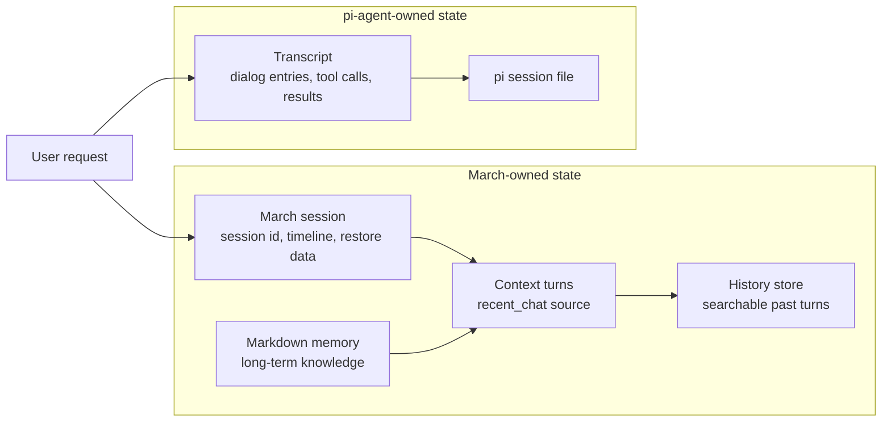
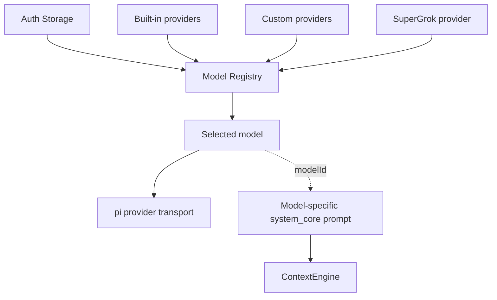

# March Architecture Boundaries

March 的核心架构不是“CLI 里调用一堆工具”，而是：**CLI 只做交互外壳；Runner 子进程承载 Agent Runtime；pi-agent 执行模型循环；March 通过 Context、Tool、Session、Workspace 四个边界接入能力。**

## 1. Main runtime chain

**Boundary rule:** CLI 只路由输入和渲染事件，不拥有 Agent 行为。Runtime 行为从 runner 子进程边界之后开始。

## 2. Agent Run lifecycle

**Boundary rule:** `runTurn` 协调一次 Agent Run，但不重写模型/工具循环；循环属于 pi-agent。

## 3. Context boundary

**Boundary rule:** March context 在 Agent Run 起点组装；后续 Model Call 继续 pi-agent transcript。provider hook 只能调整 transport payload，不能重建 March context layers。

## 4. Runtime capability boundary

**Boundary rule:** high-level runtime code 只装配能力。每个 capability 拥有自身行为；runner 不应该增长 capability-specific branches。

## 5. Workspace and process boundary

**Boundary rule:** workspace supervision 选择 active project/session 并路由输出；单个 Agent Runtime 不关心全局 workspace 展示策略。

## 6. State boundary

**Boundary rule:** March session、pi session、ContextEngine turns、history、memory 相关但不能混成一个状态对象；混用会导致 stale context 和难排查的恢复行为。

## 7. Provider boundary

**Boundary rule:** provider 负责 auth、model discovery、quota/product transport 和 request execution；它不决定 March context 结构，`modelId` 只影响 model-specific system prompt。

## Architectural invariants

1. **Shell is not Agent Runtime.** CLI/TUI handles interaction, commands, and rendering; Agent behavior lives behind the runner boundary.
2. **Runtime wires, capabilities execute.** Core passes capability contracts into pi-agent; capability modules own behavior.
3. **Context is reconstructed, transcript is continued.** ContextEngine builds initial March context; pi-agent transcript carries in-run continuity.
4. **Provider is transport, not policy.** Provider code handles model connection concerns, not March context policy.
5. **Workspace is supervision, not execution.** Workspace code selects and routes project runtimes; individual runtimes execute Agent Runs.
6. **State stays layered.** March state, pi state, history, and memory remain separate so resume, recall, and rendering stay predictable.
