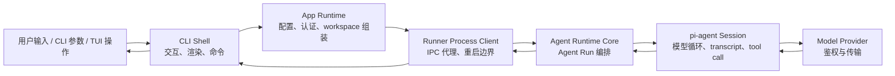
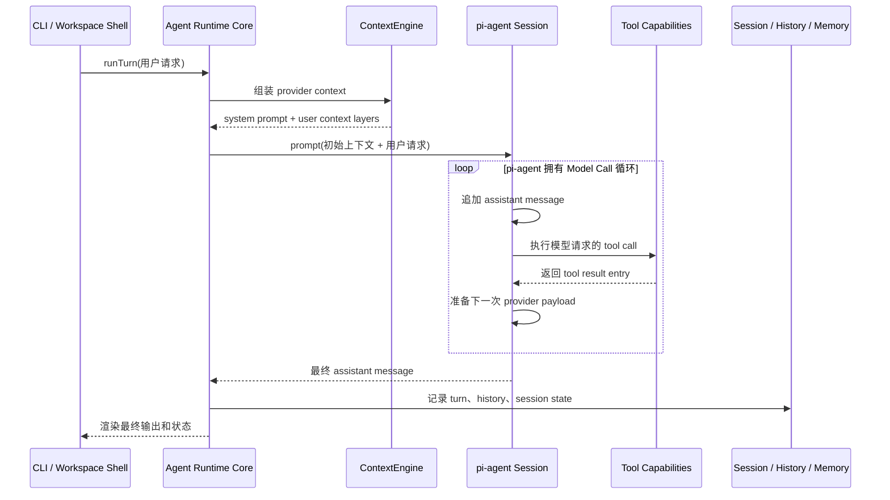
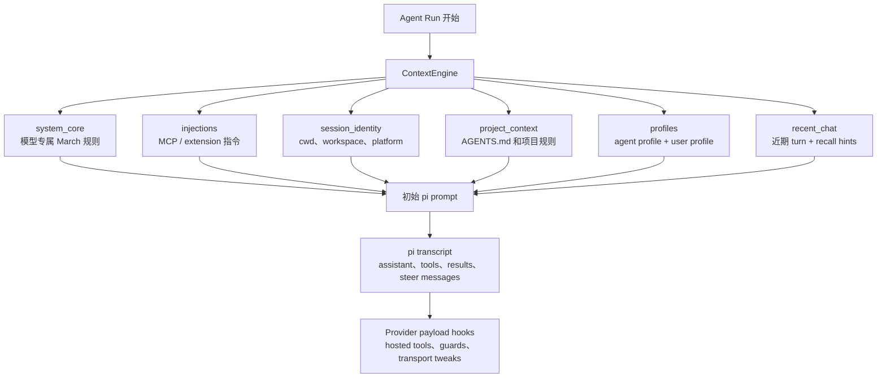
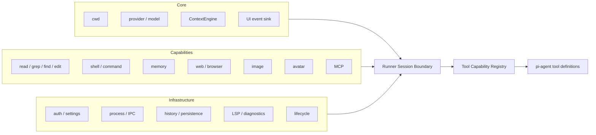
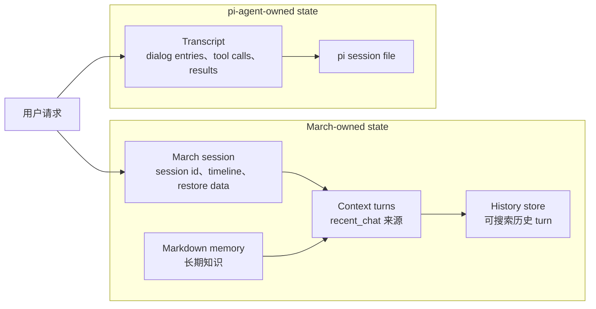
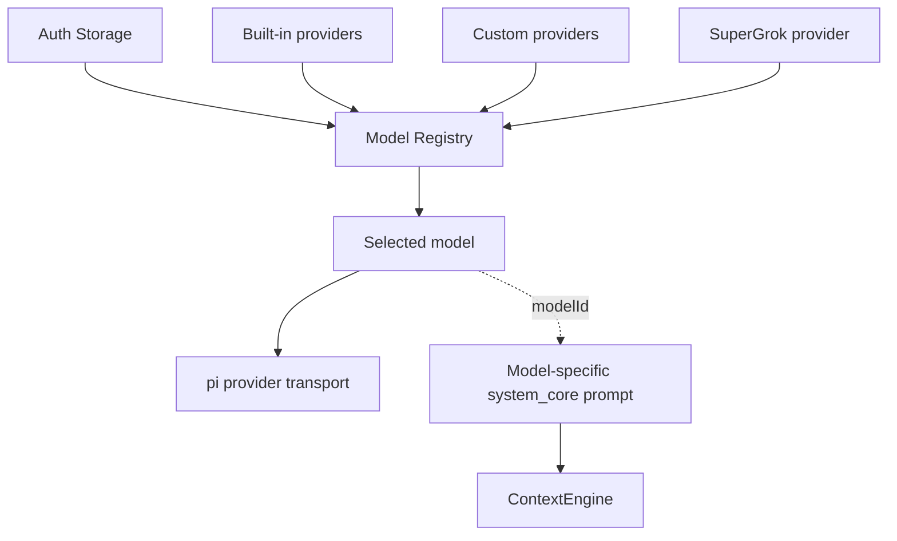
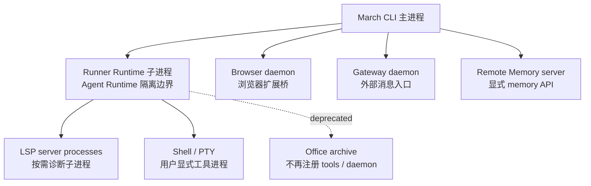

# March 架构边界

March 的核心架构不是“CLI 里调用一堆工具”，而是：**CLI 只做交互外壳；Runner 子进程承载 Agent Runtime；pi-agent 执行模型循环；March 通过 Context、Tool、Session、Workspace 四个边界接入能力。**

## 1. 主运行链路

**边界规则：** CLI 只路由输入和渲染事件，不拥有 Agent 行为。Runtime 行为从 runner 子进程边界之后开始。

## 2. Agent Run 生命周期

**边界规则：** `runTurn` 协调一次 Agent Run，但不重写模型/工具循环；循环属于 pi-agent。

## 3. Context 边界

**边界规则：** March context 在 Agent Run 起点组装；后续 Model Call 继续 pi-agent transcript。provider hook 只能调整 transport payload，不能重建 March context layers。

## 4. Runtime capability 边界

**边界规则：** high-level runtime code 只装配能力。每个 capability 拥有自身行为；runner 不应该增长 capability-specific branches。

## 5. Workspace 与进程边界

**边界规则：** workspace supervision 选择 active project/session 并路由输出；单个 Agent Runtime 不关心全局 workspace 展示策略。

## 6. State 边界

**边界规则：** March session、pi session、ContextEngine turns、history、memory 相关但不能混成一个状态对象；混用会导致 stale context 和难排查的恢复行为。

## 7. Provider 边界

**边界规则：** provider 负责 auth、model discovery、quota/product transport 和 request execution；它不决定 March context 结构，`modelId` 只影响 model-specific system prompt。

## 8. Daemon 与子进程边界

**边界规则：** browser、gateway、memory serve 是 daemon-like 服务；runner 是运行时隔离子进程；LSP、PTY、command_exec 是按需进程。Office 当前是弃用归档，不属于运行期 capability。

## 架构不变量

1. **Shell 不是 Agent Runtime。** CLI/TUI 处理交互、命令和渲染；Agent 行为在 runner 边界之后。
2. **Runtime 只装配，capability 负责执行。** Core 把 capability contract 接入 pi-agent；capability module 拥有具体行为。
3. **Context 重新组装，transcript 继续推进。** ContextEngine 构造初始 March context；pi-agent transcript 承载运行中的连续性。
4. **Provider 是传输边界，不是策略边界。** Provider 处理模型连接问题，不处理 March context policy。
5. **Workspace 是监督边界，不是执行边界。** Workspace 代码选择和路由 project runtime；单个 runtime 执行 Agent Run。
6. **Process 边界不能混用。** Daemon、runner 子进程和按需 spawned process 的生命周期不同，不能用同一套状态假设处理。
7. **State 必须分层。** March state、pi state、history、memory 保持分离，resume、recall 和渲染才可预测。